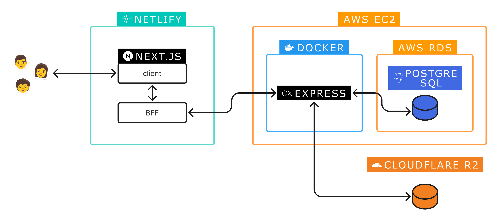
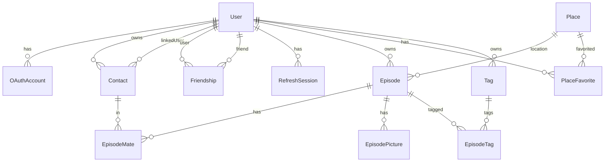
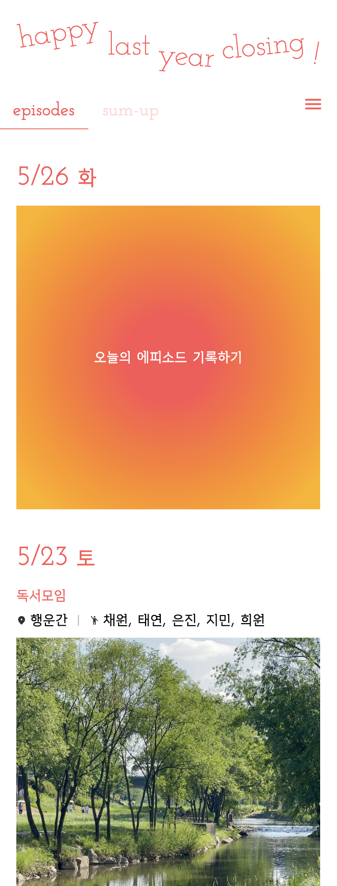
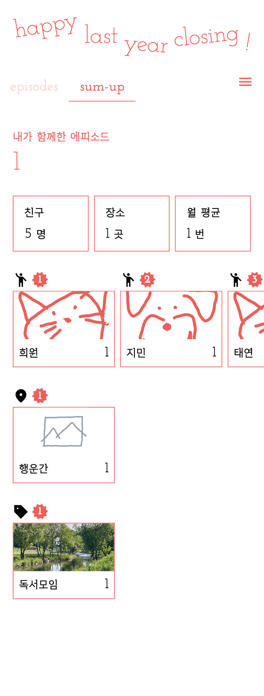
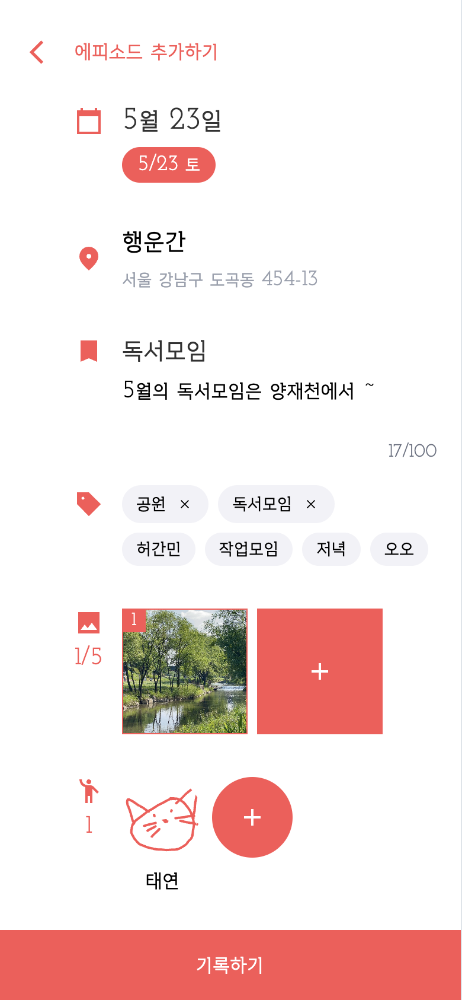
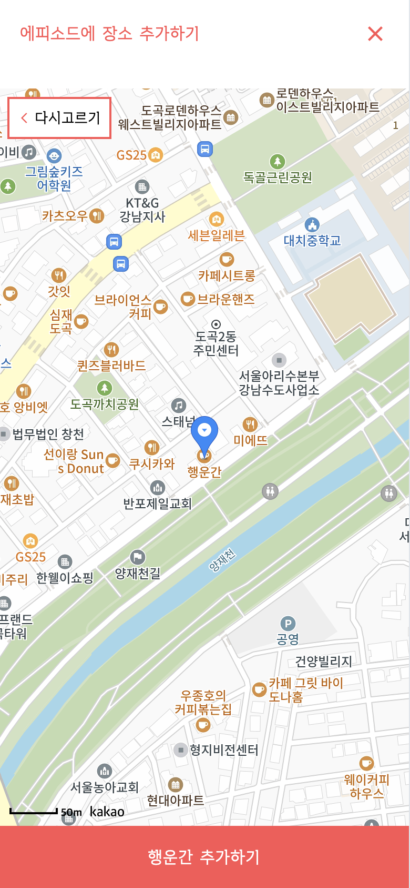
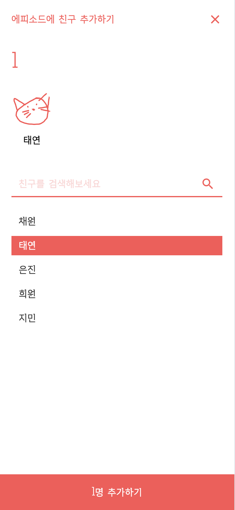

한 해를 함께한 소중한 순간들을 기록하고, 연말에 친구·장소·태그별 통계로 회고할 수 있는 에피소드 기록 웹 앱  
새해를 맞아 다가올 일들을 기대하면서도 지난 한 해를 곱씹어볼 수 있길 바라는 마음에서 시작했습니다.  
(그래서 happy ~~new year~~ last year closing 입니다, 추억 연말결산! 🌅)

### fe tech stack

### be tech stack

### infra

 
 

# features

- 사용자는 날짜&ast;, 장소&ast;, 제목&ast;, 설명, 태그, 사진&ast;, 친구 정보로 '에피소드'를 작성할 수 있습니다. (&ast;필수 항목)
- 메인 페이지의 'episodes' 탭에서는 작성된 에피소드들을 카드 형태로 볼 수 있고,
- 'sum up' 탭에서는 에피소드들의 통계를 확인할 수 있습니다.
- 하루에 하나의 에피소드 작성을 best practice로 보고있습니다.
 
 

# architecture

 
 

# database

 
 

# screenshots 

### main page

 

### write page

